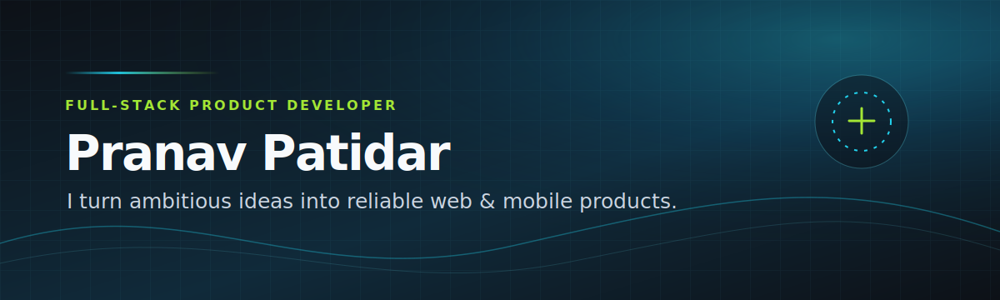

  

   
   

  
  

  
Web · mobile · real-time systems · practical AI

## Building products from the interface to the infrastructure

I’m a full-stack product developer who turns ideas into useful web and mobile experiences. I care about the details that make a product feel dependable: clear interfaces, well-shaped APIs, real-time feedback, and systems that hold up beyond a demo.

> **Currently:** building practical, mobile-first tools around real-world data, AI-assisted workflows, and resilient backend systems.

## Featured work

### 01 — IntelliFarm

**A crop-season copilot for smallholder farmers in India.** IntelliFarm brings crop planning, weather, mandi prices, grounded AI assistance, disease triage, and ESP32 telemetry into a single web and mobile product.

`TypeScript` · `Expo` · `NestJS` · `PostgreSQL` · `Turborepo`

[View repository](https://github.com/PranavPatidar28/intellifarm-rebuid) · [Explore live demo](https://intellifarm-xi.vercel.app)

### 02 — AgroRadar

**Crop disease detection with a real-time outbreak map.** Farmers can report a disease from the field, receive cloud or on-device diagnosis, and get alerts when nearby outbreaks emerge—even through intermittent connectivity.

`React Native` · `NestJS` · `Socket.IO` · `PostgreSQL` · `TFLite`

[View repository](https://github.com/PranavPatidar28/Crop-Disease-detection-and-map)

### 03 — IntelliVault

**A private, structured note workspace.** IntelliVault pairs a rich-text editor with hierarchical tags, analytics, secure authentication, and responsive, dark-mode-first product design.

`Next.js` · `TypeScript` · `Prisma` · `PostgreSQL` · `Better Auth`

[View repository](https://github.com/PranavPatidar28/intellivault)

## Focused toolkit

  
  
  
  
  
  
  
  

## Selected GitHub proof

  
   
   
  
   
   
  

 

  

## Let’s build something useful

If you’re working on a product that needs thoughtful full-stack execution, I’d love to hear about it.

  
  

  
Contribution trail

   
  <picture>
    <source media="(prefers-color-scheme: dark)" srcset="https://raw.githubusercontent.com/PranavPatidar28/PranavPatidar28/output/github-snake-dark.svg" />
    <source media="(prefers-color-scheme: light)" srcset="https://raw.githubusercontent.com/PranavPatidar28/PranavPatidar28/output/github-snake.svg" />
    
  </picture>

