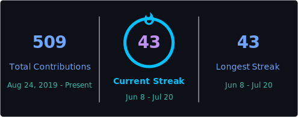

<!-- ════════════════════════ HEADER BANNER ════════════════════════ -->
<a href="https://github.com/pranavpatidar28">
  
</a>

<!-- ════════════════════════ TYPING ANIMATION ════════════════════════ -->
<div align="center">

[](https://git.io/typing-svg)

<!-- ════════════════════════ STAT BADGES ════════════════════════ -->

<a href="https://github.com/pranavpatidar28?tab=followers">
  
</a>


</div>

<!-- ════════════════════════ ABOUT ME ════════════════════════ -->
##  About Me

```typescript
const pranav = {
  pronouns: "he" / "him",
  role: "Full-Stack Developer",
  code: ["TypeScript", "JavaScript", "SQL"],
  stack: {
    frontend: ["Next.js", "React", "React Native (Expo)", "TailwindCSS"],
    backend: ["NestJS", "Node.js", "Prisma", "PostgreSQL"],
    realtime: ["Socket.IO", "WebSockets"],
    tooling: ["Turborepo", "pnpm", "Zustand", "TanStack Query"],
  },
  currentlyBuilding: "products that actually solve real problems 🌾",
  motto: "Learn everything. Build for fun. Ship for impact.",
};
```

> 🔭 I'm a **tech enthusiast who loves to learn everything** — I build full-stack web & mobile apps, from smart farming assistants to real-time crop-disease radars.
> 🌱 Currently going deep on **scalable backends, real-time systems, and clean architecture**.
> ⚡ Fun fact: I treat side projects like startups — design it, build it, ship it, then break it and rebuild it better.

<br/>

<!-- ════════════════════════ TECH STACK ════════════════════════ -->
## 🛠️ Tech Stack & Tools

<div align="center">

### Languages


### Frameworks & Libraries


### Data & Infra


### Tooling


</div>

<br/>

<!-- ════════════════════════ FEATURED PROJECTS ════════════════════════ -->
## 🚀 Featured Projects

<div align="center">
<i>A few things I've designed, built, and shipped end-to-end 👇</i>
</div>

<br/>

<table>
<tr>
<td width="50%" valign="top">

<div align="center">


</div>

**Smart farming, end-to-end.** Web + mobile clients on a single NestJS API — weather, crop advisory, live mandi prices, an **AI assistant**, disease analysis, and **ESP32 IoT** telemetry.

<div align="center">


[](https://github.com/pranavpatidar28/intellifarm-rebuid)
[](https://intellifarm-xi.vercel.app)

</div>

</td>
<td width="50%" valign="top">

<div align="center">


</div>

**Crop disease detection & outbreak mapping.** An Expo mobile app + NestJS backend monorepo that detects diseases and pushes **real-time outbreak alerts** across a region.

<div align="center">


[](https://github.com/pranavpatidar28/Crop-Disease-detection-and-map)

</div>

</td>
</tr>
<tr>
<td width="50%" valign="top">

<div align="center">


</div>

**Your data, locked down.** A full-stack secure vault for storing and managing sensitive data, built on a database-backed, component-driven architecture.

<div align="center">


[](https://github.com/pranavpatidar28/intellivault)

</div>

</td>
<td width="50%" valign="top">

<div align="center">


</div>

**Real-time messaging, low latency.** A chat app with a dedicated WebSocket frontend & backend, built for instant delivery and live presence.

<div align="center">


[](https://github.com/pranavpatidar28/ws-chat-app-frontend)
[](https://github.com/pranavpatidar28/ws-chat-app-backend)

</div>

</td>
</tr>
</table>

<br/>

<!-- ════════════════════════ GITHUB STATS ════════════════════════ -->
## 📊 GitHub Stats

<div align="center">



</div>

<br/>

<!-- ════════════════════════ ACTIVITY GRAPH ════════════════════════ -->
## 📈 Contribution Graph

<div align="center">

[](https://github.com/ashutosh00710/github-readme-activity-graph)

</div>

<!-- ════════════════════════ SNAKE ANIMATION ════════════════════════ -->
<div align="center">

<picture>
  <source media="(prefers-color-scheme: dark)" srcset="https://raw.githubusercontent.com/pranavpatidar28/pranavpatidar28/output/github-snake-dark.svg" />
  <source media="(prefers-color-scheme: light)" srcset="https://raw.githubusercontent.com/pranavpatidar28/pranavpatidar28/output/github-snake.svg" />
  
</picture>

</div>

<br/>

<!-- ════════════════════════ CONNECT ════════════════════════ -->
## 🤝 Connect With Me

<div align="center">

<a href="https://www.linkedin.com/in/pranav-patidar/">
  
</a>
<a href="https://x.com/pranavloveher">
  
</a>
<a href="https://instagram.com/pranav_patidar_">
  
</a>
<a href="mailto:pranavpatidar285@gmail.com">
  
</a>

</div>

<!-- ════════════════════════ FOOTER ════════════════════════ -->


<div align="center">
  <sub>⭐️ From <a href="https://github.com/pranavpatidar28">Pranav Patidar</a> — thanks for stopping by!</sub>
</div>
