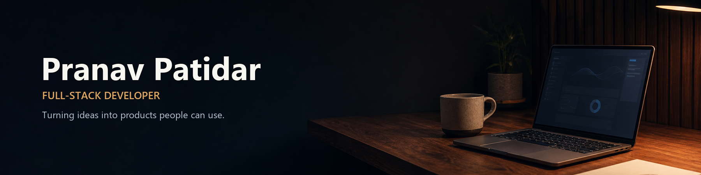

  

  I build dependable web, mobile, and desktop products—from the first idea to the shipped experience.

  <a href="https://pranavpatidar.in"><strong>Portfolio</strong></a>
  &nbsp;·&nbsp;
  <a href="https://www.linkedin.com/in/pranav-patidar/"><strong>LinkedIn</strong></a>
  &nbsp;·&nbsp;
  <a href="https://x.com/pranavloveher"><strong>X</strong></a>
  &nbsp;·&nbsp;
  <a href="mailto:pranavpatidar285@gmail.com"><strong>Email</strong></a>

---

### About

I'm a full-stack developer focused on product engineering. I work across interface design, APIs, data, deployment, and the final layer of polish that makes software feel complete.

- Building end-to-end products with **TypeScript, React, Next.js, and Node.js**
- Designing **backends, real-time systems, and reliable data layers**
- Creating cross-platform experiences with **Electron and React Native**
- Applying **AI to practical problems** where it creates real value

### Selected work

<table>
  <tr>
    <td width="50%" valign="top">
      <h3><a href="https://smartdeck.site">SmartDeck ↗</a></h3>
      
A customizable desktop command center for shortcuts, controls, widgets, and everyday workflows.

      Electron · React · TypeScript
    </td>
    <td width="50%" valign="top">
      <h3><a href="https://github.com/PranavPatidar28/slopshield">SlopShield ↗</a></h3>
      
A private, explainable browser extension that filters low-signal social content entirely on-device.

      TypeScript · Chrome MV3 · Local processing
    </td>
  </tr>
  <tr>
    <td width="50%" valign="top">
      <h3><a href="https://github.com/PranavPatidar28/Crop-Disease-detection-and-map">AgroRadar ↗</a></h3>
      
Offline-first crop disease detection and outbreak mapping with on-device AI and real-time alerts.

      React Native · NestJS · PostgreSQL
    </td>
    <td width="50%" valign="top">
      <h3><a href="https://github.com/PranavPatidar28/intellifarm-rebuid">IntelliFarm ↗</a></h3>
      
An India-first crop-season copilot combining farm planning, advisory tools, and mobile workflows.

      Expo · NestJS · Prisma · Turborepo
    </td>
  </tr>
</table>

### Core stack

  <code>TypeScript</code>&nbsp;&nbsp;
  <code>React</code>&nbsp;&nbsp;
  <code>Next.js</code>&nbsp;&nbsp;
  <code>React Native</code>&nbsp;&nbsp;
  <code>Electron</code>&nbsp;&nbsp;
  <code>NestJS</code>&nbsp;&nbsp;
  <code>PostgreSQL</code>&nbsp;&nbsp;
  <code>Prisma</code>&nbsp;&nbsp;
  <code>Docker</code>

---

  Open to thoughtful products, ambitious engineering problems, and useful collaborations.

